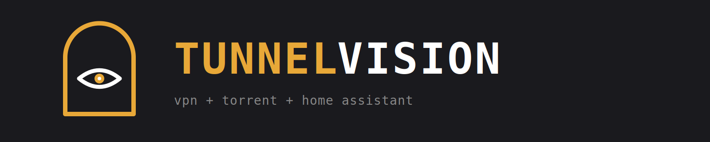
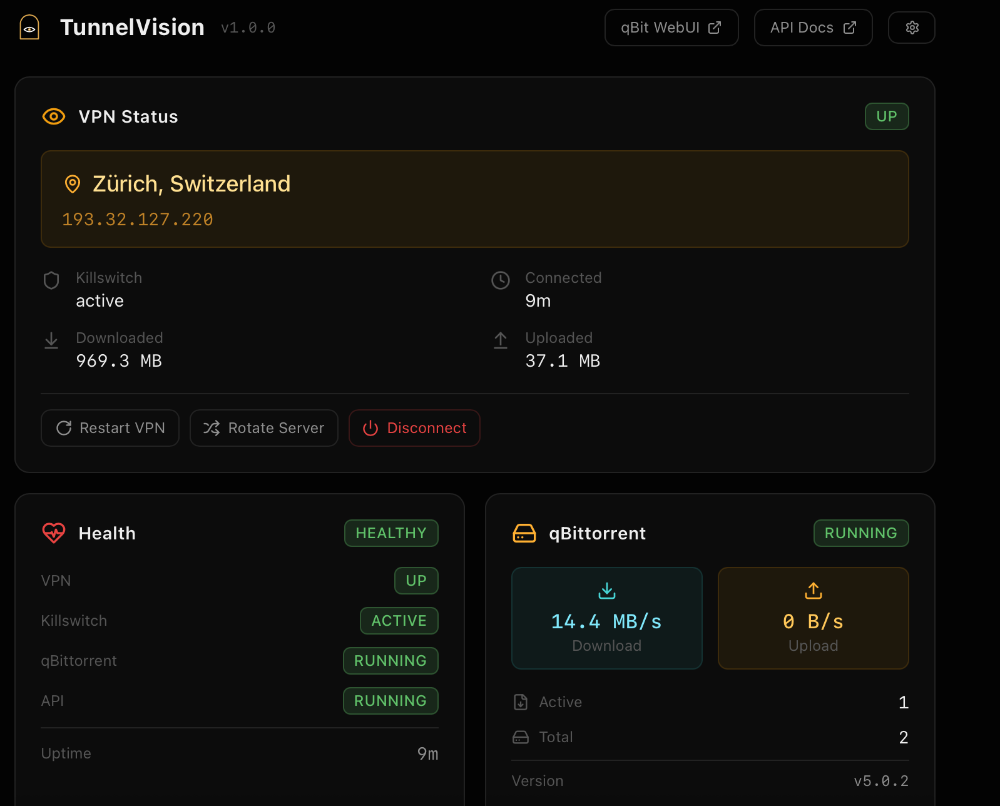
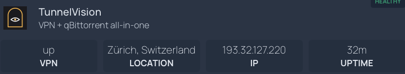

<p align="center">
  
</p>

<p align="center">
  <a href="LICENSE"></a>
  
  
  
  
</p>

---

qBittorrent + WireGuard/OpenVPN + killswitch + REST API + dashboard. One container. Full visibility.

Drop your VPN config, `docker compose up`, and you can see everything — what IP you're on, where you're exiting, transfer stats, killswitch state, qBittorrent health. From your Homepage dashboard, from Home Assistant, from Prometheus, from the built-in UI, from `curl`. No guessing. No SSH-ing in.

Works with **any WireGuard or OpenVPN provider**. Native integrations for [Mullvad](https://mullvad.net), [IVPN](https://ivpn.net), and [PIA](https://privateinternetaccess.com) (ephemeral key negotiation, port forwarding). Or bring your own config from Proton, AirVPN, Windscribe, or your own server.

<p align="center">
  
</p>

## Quick Start

**One-liner install:**

```bash
curl -fsSL https://raw.githubusercontent.com/jasondostal/tunnelvision/main/scripts/install.sh | bash
```

**Or manually:**

```bash
mkdir -p tunnelvision/wireguard
cp /path/to/wg0.conf tunnelvision/wireguard/

curl -O https://raw.githubusercontent.com/jasondostal/tunnelvision/main/docker-compose.yml
docker compose up -d
```

Three things are now running inside one container:
- **qBittorrent WebUI** on port `8080`
- **TunnelVision API + Dashboard** on port `8081`
- **WireGuard/OpenVPN** with nftables killswitch

```bash
curl http://localhost:8081/api/v1/health | jq .
```

## Already running gluetun?

Keep it. TunnelVision can run alongside gluetun in **sidecar mode** — gluetun manages the VPN tunnel, TunnelVision adds the visibility layer. You get the dashboard, API, Home Assistant integration, and monitoring without changing your VPN setup. And you inherit gluetun's 30+ provider support instantly.

```yaml
services:
  gluetun:
    image: qmcgaw/gluetun
    # ... your existing gluetun config ...

  tunnelvision:
    image: ghcr.io/jasondostal/tunnelvision:latest
    network_mode: "service:gluetun"
    environment:
      - VPN_PROVIDER=gluetun
      - GLUETUN_URL=http://localhost:8000
    volumes:
      - ./config:/config
```

TunnelVision reads gluetun's API for status but never touches the tunnel. Full read-only observability.

## Integrations

### Homepage

<p align="center">
  
</p>

Drops right into [Homepage](https://gethomepage.dev) using the `customapi` widget. Pick the fields you want to see:

```yaml
- TunnelVision:
    icon: https://raw.githubusercontent.com/jasondostal/tunnelvision/main/images/tunnelvision-mark-dark-512.png
    href: http://your-host:8081
    description: VPN + qBittorrent
    widget:
      type: customapi
      url: http://tunnelvision:8081/api/v1/vpn/status
      mappings:
        - field: state
          label: VPN
          format: text
        - field: location
          label: Location
          format: text
        - field: public_ip
          label: IP
          format: text
        - field: uptime
          label: Uptime
          format: text
```

<details>
<summary>Available fields for your widget</summary>

Pick any 4 from `/api/v1/vpn/status`:

| Field | Example | Good for |
|-------|---------|----------|
| `state` | `up` | Connection status at a glance |
| `location` | `Zurich, Switzerland` | Where you're exiting |
| `public_ip` | `193.32.127.220` | Current VPN IP |
| `uptime` | `2h 34m` | How long the tunnel's been up |
| `killswitch` | `active` | Firewall status |
| `country` | `Switzerland` | Exit country only |
| `city` | `Zurich` | Exit city only |
| `provider` | `mullvad` | VPN provider |

Or use `/api/v1/qbt/status` for torrent-focused widgets:

| Field | Example | Good for |
|-------|---------|----------|
| `state` | `running` | qBit health |
| `download_speed` | `5242880` | Current download (bytes/s) |
| `upload_speed` | `1048576` | Current upload (bytes/s) |
| `active_torrents` | `3` | Active count |
| `total_torrents` | `47` | Library size |

</details>

### Home Assistant

<p align="center">
  
</p>

Native [HACS integration](https://github.com/jasondostal/tunnelvision-ha). 23 entities, real-time SSE updates, config flow, zero YAML.

**Install via HACS:**
1. HACS → Integrations → Three dots → **Custom Repositories**
2. Paste `https://github.com/jasondostal/tunnelvision-ha` → category **Integration** → **Add**
3. Search **TunnelVision** → **Download** → Restart HA
4. **Settings → Integrations → Add → TunnelVision** — enter your host and port

You get:
- **12 sensors** — VPN state, public IP, location, speeds, transfer stats, torrent counts, provider
- **4 binary sensors** — VPN connected, killswitch active, healthy, qBittorrent running
- **5 buttons** — Restart VPN, rotate server, restart qBit, pause/resume torrents
- **2 switches** — VPN on/off, Killswitch on/off (reflect actual state)
- **3 services** — `tunnelvision.vpn`, `tunnelvision.qbittorrent`, `tunnelvision.killswitch` for automations

No MQTT required. Real-time updates via Server-Sent Events (SSE) with polling fallback — state changes appear in HA within seconds, not minutes.

### Prometheus + Grafana

```bash
curl http://localhost:8081/metrics
```

Exports `tunnelvision_vpn_up`, `tunnelvision_killswitch_active`, `tunnelvision_transfer_rx_bytes_total`, `tunnelvision_transfer_tx_bytes_total`, `tunnelvision_vpn_connected_seconds`, and more. Scrape it, graph it, alert on it.

A ready-made Grafana dashboard is included at [`examples/grafana-dashboard.json`](examples/grafana-dashboard.json) — import it and point at your Prometheus data source.

### Sonarr / Radarr / Prowlarr

Use `tunnelvision` (or your container name) as the download client host in your arr stack:
- **Host**: `tunnelvision` (Docker DNS) or your server IP
- **Port**: `8080`
- **Username**: `admin`
- **Password**: your qBittorrent password

All torrent traffic routes through the VPN. The killswitch ensures nothing leaks if the tunnel drops.

### Notifications

Webhook notifications for VPN state changes — reconnects, failures, port forwarding updates. Supports Discord, Slack, Gotify, and generic webhooks out of the box.

| Variable | What it does |
|----------|-------------|
| `NOTIFY_WEBHOOK_URL` | Discord/Slack webhook URL, or any generic endpoint |
| `NOTIFY_GOTIFY_URL` | Gotify server URL |
| `NOTIFY_GOTIFY_TOKEN` | Gotify app token |

## Authentication

Off by default. Three layers, all optional, all additive:

| Method | Env Vars | How it works |
|--------|----------|-------------|
| **None** (default) | *(nothing set)* | Everything open |
| **API key** | `API_KEY` | `X-API-Key` header for programmatic access (Homepage, HACS, Prometheus) |
| **Local login** | `ADMIN_USER` + `ADMIN_PASS` | Login form in the dashboard, session cookie |
| **Proxy bypass** | `AUTH_PROXY_HEADER` | Trusted header from your reverse proxy (Authentik, Authelia, Traefik, nginx) — skips the login form |

Set `AUTH_PROXY_HEADER=Remote-User` (or `X-Forwarded-User`, whatever your proxy sends) and users authenticated by your reverse proxy get straight through. Direct users see the login form. API key always works for machine-to-machine.

## Settings

Configurable from the dashboard UI (gear icon) or by editing `/config/tunnelvision.yml` directly. Settings in the YAML file override environment variables.

```yaml
# /config/tunnelvision.yml
admin_user: admin
admin_pass: changeme
auth_proxy_header: Remote-User
vpn_provider: custom
health_check_interval: "30"
```

## Configuration

<details>
<summary>Environment variables</summary>

All via environment variables. Sensible defaults for everything. Settings UI and `/config/tunnelvision.yml` override these.

| Variable | Default | What it does |
|----------|---------|-------------|
| `ADMIN_USER` | *(empty)* | Set to enable login (single user) |
| `ADMIN_PASS` | *(empty)* | Password for ADMIN_USER |
| `AUTH_PROXY_HEADER` | *(empty)* | Trusted header from reverse proxy (e.g. `Remote-User`) |
| `VPN_ENABLED` | `true` | Enable/disable VPN |
| `VPN_TYPE` | `auto` | VPN engine: `auto`, `wireguard`, or `openvpn` |
| `VPN_PROVIDER` | `custom` | VPN provider: `custom`, `mullvad`, `ivpn`, `pia`, or `gluetun` (sidecar mode) |
| `WIREGUARD_PRIVATE_KEY` | *(empty)* | WireGuard private key for Mullvad/IVPN (base64, 44 chars) |
| `WIREGUARD_ADDRESSES` | *(empty)* | WireGuard interface address for Mullvad/IVPN (e.g. `10.66.0.1/32`) |
| `VPN_DNS` | *(from config)* | Override DNS server (default: provider DNS or `10.64.0.1`) |
| `VPN_COUNTRY` | *(empty)* | Filter server rotation by country (e.g. `ch`, `us`) |
| `VPN_CITY` | *(empty)* | Filter server rotation by city (e.g. `zurich`) |
| `KILLSWITCH_ENABLED` | `true` | Enable nftables killswitch |
| `WEBUI_PORT` | `8080` | qBittorrent WebUI port |
| `API_PORT` | `8081` | TunnelVision API port |
| `API_KEY` | *(empty)* | Set to require `X-API-Key` header on API calls |
| `UI_ENABLED` | `true` | Serve the web dashboard |
| `WEBUI_ALLOWED_NETWORKS` | `192.168.0.0/16,...` | Networks allowed to access WebUI and API |
| `MQTT_ENABLED` | `false` | Enable MQTT with Home Assistant auto-discovery |
| `MQTT_BROKER` | *(empty)* | MQTT broker hostname/IP |
| `MQTT_PORT` | `1883` | MQTT broker port |
| `MQTT_USER` / `MQTT_PASS` | *(empty)* | MQTT authentication |
| `GLUETUN_URL` | `http://gluetun:8000` | Gluetun API URL (sidecar mode) |
| `GLUETUN_API_KEY` | *(empty)* | Gluetun API key (if auth is enabled) |
| `AUTO_RECONNECT` | `true` | Auto-reconnect VPN on failure (watchdog) |
| `NOTIFY_WEBHOOK_URL` | *(empty)* | Discord/Slack/generic webhook for notifications |
| `NOTIFY_GOTIFY_URL` | *(empty)* | Gotify server URL |
| `NOTIFY_GOTIFY_TOKEN` | *(empty)* | Gotify app token |
| `PORT_FORWARD_ENABLED` | `false` | Enable port forwarding (PIA) |
| `PUID` | `1000` | User ID for file permissions |
| `PGID` | `1000` | Group ID for file permissions |
| `TZ` | `America/Chicago` | Container timezone |
| `HEALTH_CHECK_INTERVAL` | `30` | Seconds between health checks |

</details>

<details>
<summary>Docker requirements</summary>

```yaml
cap_add:
  - NET_ADMIN          # Required for WireGuard and nftables
devices:
  - /dev/net/tun       # Required for WireGuard tunnel
sysctls:
  - net.ipv4.conf.all.src_valid_mark=1    # WireGuard routing
  - net.ipv6.conf.all.disable_ipv6=1      # IPv6 leak prevention
```

| Volume | Purpose |
|--------|---------|
| `/config` | qBittorrent config, runtime state |
| `/config/wireguard` | WireGuard config files (`wg0.conf`) |
| `/downloads` | Torrent download directory |

</details>

<details>
<summary>API endpoints</summary>

Interactive docs at `http://localhost:8081/api/docs` (Swagger) when running.

| Endpoint | What it returns |
|----------|----------------|
| `GET /api/v1/health` | Container health — VPN, killswitch, qBittorrent, watchdog, uptime |
| `GET /api/v1/vpn/status` | Full VPN status — IP, location, uptime, transfer stats |
| `GET /api/v1/vpn/ip` | Just the public IP |
| `GET /api/v1/vpn/check` | Provider-verified connection check |
| `GET /api/v1/vpn/configs` | Available VPN config files and active config |
| `GET /api/v1/qbt/status` | Speeds, torrent counts, version |
| `GET /api/v1/system` | Container versions and uptime |
| `GET /api/v1/config` | Current configuration (no secrets) |
| `GET /api/v1/settings` | Persistent settings (secrets masked) |
| `GET /api/v1/history` | Connection history — rotations, reconnects, watchdog events |
| `GET /api/v1/events` | SSE stream — real-time state changes |
| `GET /api/v1/speedtest` | Run a VPN speed test |
| `GET /metrics` | Prometheus metrics |
| `POST /api/v1/vpn/connect` | Connect to a specific server |
| `POST /api/v1/vpn/restart` | Restart VPN tunnel |
| `POST /api/v1/vpn/rotate` | Rotate to a new server |
| `POST /api/v1/vpn/disconnect` | Disconnect VPN |
| `POST /api/v1/killswitch/enable` | Enable killswitch |
| `POST /api/v1/killswitch/disable` | Disable killswitch |
| `POST /api/v1/qbt/restart` | Restart qBittorrent |
| `POST /api/v1/qbt/pause` | Pause all torrents |
| `POST /api/v1/qbt/resume` | Resume all torrents |
| `POST /api/v1/setup/credentials` | Validate and save provider-specific credentials |
| `POST /api/v1/setup/server` | Select a server during setup (generates WireGuard config) |
| `GET /api/v1/backup` | Export config backup (JSON) |
| `POST /api/v1/backup/restore` | Restore from backup |

</details>

<details>
<summary>Migrating from other setups</summary>

**From gluetun + qBittorrent:** Two options. Full migration: copy your qBittorrent config and WireGuard config, point the volumes, done. Gentle option: keep gluetun for the tunnel and add TunnelVision in [sidecar mode](#already-running-gluetun) for visibility — zero risk, try before you switch.

**From Trigus42/qbittorrentvpn:** Same config structure — mount `/config` and `/config/wireguard` the same way.

**From transmission-openvpn:** You'll need to switch to qBittorrent. The VPN config carries over if it's WireGuard or OpenVPN.

</details>

<details>
<summary>Architecture</summary>

**Standalone mode** — TunnelVision manages everything:

```
┌──────────────────────────────────────────────────────────┐
│  TunnelVision Container                                  │
│                                                          │
│  ┌─────────────────┐  ┌──────────────┐  ┌────────────┐  │
│  │  WireGuard/OVPN  │  │ qBittorrent  │  │ FastAPI    │  │
│  │  + nftables      │  │   -nox       │  │ REST API   │  │
│  │  killswitch      │  │              │  │ + React UI │  │
│  └────────┬─────────┘  └──────┬───────┘  └─────┬──────┘  │
│           │                   │                 │         │
│           │    s6-overlay (process supervision)  │         │
│           └───────────────────┼─────────────────┘         │
│                               │                           │
│  init-environment ──► init-wireguard ──► init-killswitch  │
│           │                                     │         │
│           └──► svc-qbittorrent    svc-api    svc-health   │
│                                                           │
│  Alpine Linux 3.21                                        │
└──────────────────────────────────────────────────────────┘
         │              │              │
    :8080 (WebUI)  :8081 (API)    wg0 (tunnel)
```

**Sidecar mode** — gluetun manages the tunnel, TunnelVision adds visibility:

```
┌─────────────────────┐    ┌──────────────────────────┐
│  Gluetun Container   │    │  TunnelVision Container   │
│                      │    │  (network_mode: gluetun)  │
│  WireGuard/OpenVPN   │◄───│                           │
│  30+ providers       │ API│  FastAPI + React UI       │
│  Tunnel management   │    │  MQTT, SSE, Prometheus    │
│                      │    │  Watchdog (read-only)     │
└──────────────────────┘    └──────────────────────────┘
```

</details>

<details>
<summary>Building from source</summary>

```bash
git clone https://github.com/jasondostal/tunnelvision.git
cd tunnelvision
make build    # Build the Docker image
make dev      # Start development environment
```

</details>

## License

[GPL-3.0](LICENSE)
