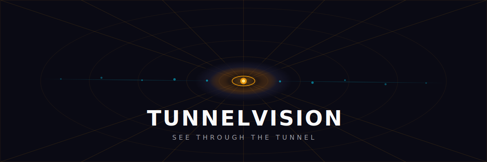

<p align="center">
  
</p>

<p align="center">
  <a href="LICENSE"></a>
  
  
  
  
  
</p>

---

Every other qBittorrent + VPN container gives you a black box. You start it, you hope it works, and when it doesn't, you're guessing. Is the VPN up? Did the killswitch hold? What IP am I actually on?

TunnelVision is different. It gives you **visibility**.

A REST API that tells you exactly what's happening inside the tunnel — VPN status, public IP, transfer stats, killswitch state, qBittorrent health — all queryable, all widgetable, all dashboardable. One container. No sidecars. No guessing.

I built this because I ran gluetun + qBittorrent + autoheal as three containers and spent more time debugging cascade restarts than actually using the thing. Then I switched to Trigus42's all-in-one and it was rock solid — but opaque. No API. No way to know if it was working without SSH-ing in. TunnelVision takes the reliability of an all-in-one and adds the visibility everyone wants.

One container. `docker compose up`. You can see through the tunnel.

## Quick Start

### 1. Create your WireGuard config

```bash
mkdir -p tunnelvision/wireguard
# Copy your wg0.conf from your VPN provider
cp /path/to/wg0.conf tunnelvision/wireguard/
```

### 2. Start it

```bash
curl -O https://raw.githubusercontent.com/jasondostal/tunnelvision/main/docker-compose.yml
docker compose up -d
```

That's it. Three things are now running inside one container:
- **qBittorrent WebUI** on port `8080`
- **TunnelVision API** on port `8081`
- **WireGuard VPN** with nftables killswitch

### 3. Check it's working

```bash
# Health check
curl http://localhost:8081/api/v1/health | jq .

# VPN status
curl http://localhost:8081/api/v1/vpn/status | jq .

# What's my IP?
curl http://localhost:8081/api/v1/vpn/ip | jq .
```

## What's in the Box

**WireGuard VPN with nftables killswitch.** Traffic only flows through the tunnel. If the VPN drops, the killswitch blocks everything — no DNS leaks, no IP leaks, no fallback to your real connection. IPv6 is blocked entirely.

**qBittorrent-nox.** Full-featured torrent client with WebUI. Your existing qBittorrent config migrates directly — just mount your config directory.

**REST API.** The real differentiator. Ten endpoints that give you full visibility:

| Endpoint | What it returns |
|----------|----------------|
| `GET /api/v1/health` | Container health — VPN, killswitch, qBittorrent, uptime |
| `GET /api/v1/vpn/status` | Full VPN status — IP, endpoint, transfer stats, handshake |
| `GET /api/v1/vpn/ip` | Just the public IP — perfect for widgets |
| `GET /api/v1/vpn/check` | Provider-verified connection — Mullvad exit IP confirmation, blacklist status |
| `GET /api/v1/vpn/server` | Server metadata — hostname, location, hosting provider, owned status |
| `GET /api/v1/vpn/account` | Account status — expiry date, days remaining |
| `GET /api/v1/vpn/servers` | Available servers — filterable by country/city |
| `GET /api/v1/qbt/status` | Download/upload speeds, active torrents, version |
| `GET /api/v1/system` | Container versions, uptime, resource info |
| `GET /api/v1/config` | Current configuration (no secrets exposed) |

**Works with any WireGuard provider.** Mount a `wg0.conf` from Mullvad, IVPN, Proton, AirVPN, or your own WireGuard server — TunnelVision handles the rest. Set `VPN_PROVIDER=mullvad` for rich API integration (server metadata, IP verification, account expiry). Leave it as `custom` for generic operation with any provider.

**Homepage integration.** Ships with a [customapi widget example](examples/homepage-widget.yml) that drops right into your Homepage dashboard.

**Optional dashboard.** A React-based UI served on the API port for visual monitoring. Disable it with `UI_ENABLED=false` if you only want the API.

## Configuration

All via environment variables. Sensible defaults for everything.

| Variable | Default | What it does |
|----------|---------|-------------|
| `VPN_ENABLED` | `true` | Enable/disable WireGuard VPN |
| `VPN_PROVIDER` | `custom` | VPN provider: `custom` or `mullvad` |
| `KILLSWITCH_ENABLED` | `true` | Enable nftables killswitch |
| `WEBUI_PORT` | `8080` | qBittorrent WebUI port |
| `API_PORT` | `8081` | TunnelVision API port |
| `API_KEY` | *(empty)* | Set to require `X-API-Key` header on API calls |
| `UI_ENABLED` | `true` | Serve the web dashboard |
| `WEBUI_ALLOWED_NETWORKS` | `192.168.0.0/16,...` | Networks allowed to access WebUI and API |
| `PUID` | `1000` | User ID for file permissions |
| `PGID` | `1000` | Group ID for file permissions |
| `TZ` | `America/Chicago` | Container timezone |
| `HEALTH_CHECK_INTERVAL` | `30` | Seconds between health checks |
| `MULLVAD_ACCOUNT` | *(empty)* | Mullvad account number for expiry checking (provider=mullvad only) |

## Architecture

```
┌──────────────────────────────────────────────────────────┐
│  TunnelVision Container                                  │
│                                                          │
│  ┌─────────────────┐  ┌──────────────┐  ┌────────────┐  │
│  │  WireGuard VPN   │  │ qBittorrent  │  │ FastAPI    │  │
│  │  + nftables      │  │   -nox       │  │ REST API   │  │
│  │  killswitch      │  │              │  │ + React UI │  │
│  └────────┬─────────┘  └──────┬───────┘  └─────┬──────┘  │
│           │                   │                 │         │
│           │    s6-overlay (process supervision)  │         │
│           └───────────────────┼─────────────────┘         │
│                               │                           │
│  init-environment ──► init-wireguard ──► init-killswitch  │
│           │                                     │         │
│           └──► svc-qbittorrent    svc-api    svc-health   │
│                                                           │
│  Alpine Linux 3.21                                        │
└──────────────────────────────────────────────────────────┘
         │              │              │
    :8080 (WebUI)  :8081 (API)    wg0 (tunnel)
```

**Boot sequence:**

1. `init-environment` — PUID/PGID setup, directories, permissions, timezone
2. `init-wireguard` — Bring up WireGuard tunnel, verify connectivity
3. `init-killswitch` — Apply nftables rules, block all non-VPN traffic
4. Services start — qBittorrent, API, health monitor (supervised, auto-restart)

## Docker Requirements

```yaml
cap_add:
  - NET_ADMIN          # Required for WireGuard and nftables
devices:
  - /dev/net/tun       # Required for WireGuard tunnel
sysctls:
  - net.ipv4.conf.all.src_valid_mark=1    # WireGuard routing
  - net.ipv6.conf.all.disable_ipv6=1      # IPv6 leak prevention
```

## Volumes

| Path | Purpose |
|------|---------|
| `/config` | qBittorrent config, runtime state |
| `/config/wireguard` | WireGuard config (`wg0.conf`) |
| `/downloads` | Torrent download directory |

## Migrating from Other Setups

**From gluetun + qBittorrent:** Copy your qBittorrent config directory and your WireGuard config. Point the volumes. Done.

**From Trigus42/qbittorrentvpn:** Same config structure — mount `/config` and `/config/wireguard` the same way.

**From transmission-openvpn:** You'll need to switch to WireGuard and qBittorrent. The VPN config and torrent client config are different.

## API Documentation

Interactive API docs are available at `http://localhost:8081/api/docs` (Swagger) and `http://localhost:8081/api/redoc` (ReDoc) when the container is running.

## Building from Source

```bash
git clone https://github.com/jasondostal/tunnelvision.git
cd tunnelvision
make build    # Build the Docker image
make dev      # Start development environment
```

## License

[MIT](LICENSE)
